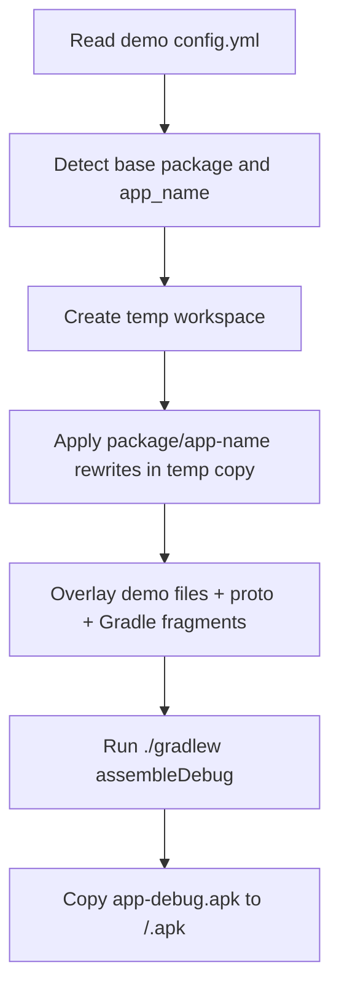

# Demo Build and Packaging

## Script

Path: [/.github/scripts/build-apk.sh](../.github/scripts/build-apk.sh)

Purpose:

- Build a customized debug APK from one folder under `tests/demos/*`.
- Apply demo overrides in an isolated temp copy of the app.
- Output APK named from app label, `app-name`, not demo folder.

## Build Flow



## Usage

```bash
.github/scripts/build-apk.sh <demo-folder> [--output <dir>]
.github/scripts/build-apk.sh -h
.github/scripts/build-apk.sh --help
```

Examples:

```bash
.github/scripts/build-apk.sh tests/demos/network-security --output .
.github/scripts/build-apk.sh tests/demos/custom-package
.github/scripts/build-apk.sh --help
```

## Config contract

Optional `config.yml` keys in a demo folder:

- `package`: Android applicationId and namespace target package.
- `app-name`: value for `@string/app_name` and output APK filename.

If omitted, defaults are discovered from base project files:

- Package from `app/build.gradle.kts` namespace.
- App name from `app/src/main/res/values/strings.xml`.

## Demo file overlays supported

The script overlays these files when present:

- `MastgTest.kt`
- `MainActivity.kt`
- `MastgTestWebView.kt`
- `AndroidManifest.xml`
- `filepaths.xml`
- `network_security_config.xml`
- `backup_rules.xml`
- `data_extraction_rules.xml`
- `proguard-rules.pro`
- `icon.png`: replaces `drawable/ic_launcher_icon_fg`. The base app's adaptive icon XMLs apply an 18 dp safe zone inset automatically.
- `*.proto`: Protocol Buffer files copied to `app/src/main/proto/`.
- `build.gradle.kts.plugins`: Gradle plugins fragment inserted at `// ADD_PLUGINS_HERE`.
- `build.gradle.kts.sections`: custom Gradle sections inserted at `// ADD_SECTIONS_HERE`.
- `build.gradle.kts.libs`: dependencies inserted at `// ADD_LIBS_HERE`.
- `build.gradle.kts.build`: build configuration fragment inserted at `// ADD_BUILD_HERE`.

## Package rewrite behavior

When `package` differs from the base package, the script:

- Rewrites `namespace` and `applicationId` in the working copy `app/build.gradle.kts`.
- Copies the source package tree to the new package path in the temp workspace.
- Rewrites Kotlin `package` and `import` occurrences from the base package to the target package.

This is done in a disposable temp directory to avoid repository mutation.

## Non-mutation guarantee

Build flow uses:

- `mktemp -d` for the parent temp directory.
- A `work` directory inside that temp directory for the disposable repo copy.
- `rsync` from the repo into the temp workspace.
- `trap 'rm -rf "$TMP_DIR"' EXIT` cleanup.

No source files under the repository are edited during a build.

## Constraints and assumptions

- `config.yml` is parsed with simple `key: value` lines.
- Package rewrite updates Kotlin `package` and `import` lines based on the base package.
- `build.gradle.kts.*` fragments are inserted at marker comments in `app/build.gradle.kts`.
- Supported fragment suffixes are `plugins`, `sections`, `libs`, and `build`.

## Output

- Built artifact source: `app/build/outputs/apk/debug/app-debug.apk`, inside the temp workspace.
- Final copied output: `<output-dir>/<app-name>.apk`.

## Troubleshooting

- `Could not detect package`: verify `namespace = "..."` exists in `app/build.gradle.kts`.
- `Could not detect app name`: verify `<string name="app_name">...</string>` exists in `strings.xml`.
- `APK not found`: run with `--stacktrace` already enabled, inspect the Gradle task failure above the error.
